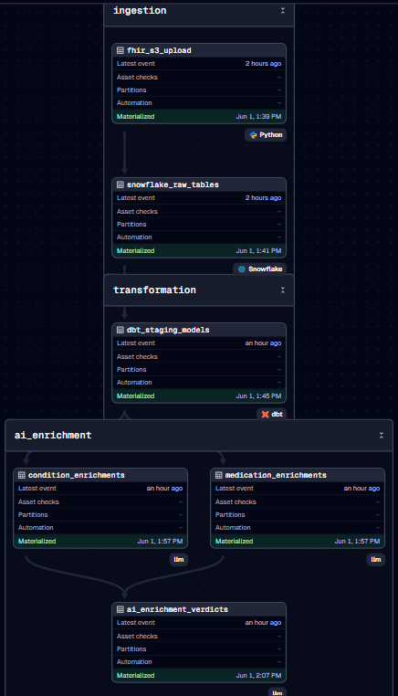

# Trust but Verify: Clinical AI Governance Engine

[](https://github.com/ericg1212/ai-healthcare-pipeline/actions/workflows/ci.yml)
[](https://github.com/ericg1212/ai-healthcare-pipeline/actions/workflows/codeql.yml)
[](https://codecov.io/gh/ericg1212/ai-healthcare-pipeline)
[](https://github.com/ericg1212/ai-healthcare-pipeline/releases)
[](https://www.python.org/)
[](https://www.snowflake.com/)
[](https://www.getdbt.com/)
[](https://dagster.io/)
[](https://aws.amazon.com/s3/)
[](https://hl7.org/fhir/R4/)


**By [Eric Grynspan](https://www.linkedin.com/in/ericgrynspan/)** &nbsp;·&nbsp; [← Denied](https://github.com/ericg1212/healthcare-claims-pipeline) &nbsp;·&nbsp; [Cleared →](https://github.com/ericg1212/agentic-rcm-pipeline)

---

Denied classified denials retrospectively. Trust but Verify adds AI governance. Cleared prevents the denial before it happens.

| Pipeline | Focus | Status |
|---|---|---|
| [Denied](https://github.com/ericg1212/healthcare-claims-pipeline) | Retrospective denial classification — separate 27K systematic denials with an upstream fix from 229K documentation failures requiring a different intervention | Live |
| **[Trust but Verify *(this project)*](https://github.com/ericg1212/ai-healthcare-pipeline)** | Clinical AI governance — LLM enrichment + rules engine cross-validation, every routing decision explainable | Live |
| [Cleared](https://github.com/ericg1212/agentic-rcm-pipeline) | Real-time prior auth prevention — RAG-enhanced payer criteria matching at point of submission, streaming ingestion | Live — Layer 1 |

---

Clinical documentation gaps are the leading driver of prior authorization denials and downstream revenue loss — a problem that CMS-0057-F now mandates health systems address with real-time decision transparency. Yet most AI enrichment pipelines produce a risk score with no audit trail. This pipeline builds the governance layer that's missing: every LLM output is cross-validated by a deterministic rules engine, confidence scores flag uncertainty before it reaches production, and any conflict routes to a human review queue with an explainable reason. The result is a two-tier output — a **Gold layer** you can trust for automated action and a **Review layer** with a traceable reason for every flagged record.

**Trust but verify:** The LLM and the rules engine must agree for a record to pass to Gold. Conflict or low confidence → Review, automatically, with a reason.

---

## Why Dual Validation?

A single confidence score only tells you how certain the model is about its own output — it cannot catch domain rule violations a generalist model might miss. Two orthogonal validators, two different failure modes:

| Validator | Failure Mode It Catches |
|---|---|
| **LLM-as-Judge** | Statistical inconsistencies within the AI output — inflated scores, flat scoring, internal contradictions |
| **Rules Engine** | Domain violations — Medication Safety flags, care gaps, missing diagnoses in high-risk comorbidity clusters |

Both must agree for Gold. One disagrees → Review, with a reason.

---

## AI Layer

Four components run on every record. Components 1, 2, and 3 are live; 4 is Phase 2.

**1. LLM Enrichment** ✓ Live

Each condition and medication record is scored across 6 clinical quality dimensions. The LLM is called via `tool_use` — structured output only, no free-text parsing. The system prompt (~2,000 tokens) is prompt-cached, so calls 2–N in a batch cost ~10% of the first call's input token price.

| Category | What It Measures |
|---|---|
| `diagnosis_specificity` | SNOMED CT / RxNorm concept specificity — leaf-level concepts score high, broad category codes score low |
| `clinical_urgency` | Implied acuity — acute/life-threatening vs. stable chronic vs. preventive |
| `coding_accuracy` | Description-to-code alignment — catches mismatches between free text and coded values |
| `medication_appropriateness` | Whether the medication is clinically reasonable given the record context |
| `drug_condition_alignment` | Recognized drug-condition pairing — metformin + T2D, lisinopril + hypertension, etc. |
| `comorbidity_risk` | Multi-condition risk signal — T2D + CKD, metabolic syndrome clusters |

Each category returns a score (0.0–1.0) and a one-sentence rationale citing the specific code or clinical pattern. `overall_confidence` is a weighted average: `diagnosis_specificity` and `coding_accuracy` at 1.5×, all others at 1×. A Pydantic `model_validator` enforces that `overall_confidence` cannot diverge more than 0.25 from the category average — invalid enrichments raise at parse time, not silently downstream.

**2. LLM-as-Judge** ✓ Live

A second LLM call audits the enrichment result. The judge receives scores only — rationale is hidden to prevent anchoring bias. Five disagreement triggers are defined:

1. **Inflated score** — category ≥ 0.85 on a Synthea record with a broad-category SNOMED concept or generic description
2. **Deflated score** — category ≤ 0.25 on a well-known chronic condition or textbook first-line medication
3. **Internal inconsistency** — `coding_accuracy ≥ 0.8` with `diagnosis_specificity ≤ 0.4`, or `medication_appropriateness ≥ 0.85` with `drug_condition_alignment ≤ 0.3`
4. **Overall drift** — `overall_confidence` diverges more than 0.20 from the simple category average
5. **Flat scoring** — all 6 scores within 0.05 of each other (enricher was not discriminating)

When the judge disagrees, it returns `corrected_confidence`, the specific `disagreement_categories`, and a one-sentence clinical reason. Both LLM calls use prompt caching on their respective system prompts.

**3. Structured Rules Engine** ✓ Live

Deterministic Python — 6 categories (Diabetes & Metabolic, Cardiovascular, Medication Safety, Care Gaps, Data Completeness, Mental Health & Behavioral). Runs parallel to the LLM on every record. Flag aggregation rule: HIGH if `flags_fired ≥ 2` OR any Medication Safety flag fires.

**4. Gold / Review Routing** ✓ Live

LLM-as-Judge disagreement or rules engine conflict → Review queue with explainable reason. Full agreement → Gold layer. Three Gold record states: `enriched_clean` (trusted for downstream analytics), `enriched_review_conflict` (judge disagrees or rules fired), `enriched_review_low_confidence` (both agree but confidence < 0.55). Each Review record carries a `review_reason` string — a human-readable explanation of exactly why it was flagged.

---

## Design Decisions

| Decision | Why |
|---|---|
| **`tool_use` over free-text parsing** | Structured output enforced at the API level — LLM can't return malformed JSON or skip a field. Pydantic validates at parse time, not silently downstream |
| **Prompt caching** | System prompt is ~2,000 tokens, identical across every record. Calls 2–N cost ~10% of call 1 — 5–10× cost reduction at batch scale |
| **`model_validator` on `overall_confidence`** | Prevents silent inconsistency where HIGH overall confidence masks LOW category scores. Enforces ≤0.25 divergence at parse time |
| **Rationale hidden from the Judge** | Anchoring bias — if the Judge sees the enricher's reasoning, it rationalizes rather than audits. Scores-only input forces independent statistical evaluation |
| **Deterministic rules alongside the LLM** | LLMs are probabilistic and can drift run-to-run. Medication Safety and comorbidity flags (T2D+CKD, polypharmacy) require a stable, auditable floor |
| **Confidence threshold below batch average** | 0.55 sits below observed avg (0.584) — routes borderline records to Review rather than auto-clearing to Gold. Tunable in `router.py` as review capacity scales |
| **Terminology validation before enrichment** | Drifted SNOMED CT / RxNorm codes produce confident but wrong enrichments. NLM vocabulary check at the ingestion boundary catches code issues before they reach the LLM |
| **Claude over GPT-4 / Gemini** | `tool_use` is a first-class primitive (not a prompt hack), prompt caching is native, and context window handles full patient context injection without truncation |

---

## Results

| Metric | Value |
|---|---|
| Records enriched | 174 (166 judged — 8 judge API errors) |
| Avg overall_confidence | 0.584 across conditions + medications |
| **Gold clean** | **13 (7.8%) — passed dual validation + confidence ≥ 0.55** |
| Review — low confidence | 39 (23.5%) — judge agreed, no flags, confidence < 0.55 |
| Review — conflict | 114 (68.7%) — judge disagreement or rules engine flag |
| Confidence threshold | 0.55 — set conservatively below batch avg (0.584) |
| Most common Judge trigger | Internal inconsistency (`coding_accuracy` vs. `diagnosis_specificity`) |
| Social SNOMED edge case | 52 social/contextual codes (employment, housing) legitimately score high `coding_accuracy` + low `diagnosis_specificity` — judge Trigger #3 calibration gap; scoped for P4 |
| Prompt cache hit rate | ~90%+ on batches > 10 records |
| Pydantic validation failures | Raised at parse time — zero silent failures downstream |

> **On the 7.8% Gold rate:** A 7.8% Gold rate is not a low-precision outcome — it is the system working correctly. The dual-validator design intentionally routes anything uncertain to Review rather than letting it pass. Synthetic FHIR data (Synthea) produces broad-category SNOMED concepts and generic descriptions that reliably trigger the LLM-as-Judge's internal inconsistency check (`coding_accuracy ≥ 0.8` with `diagnosis_specificity ≤ 0.4`). On real EHR data with leaf-level SNOMED CT codes and clinical documentation, the Gold rate would be materially higher. The pipeline's value is not the Gold rate itself — it is that every non-Gold record carries an explainable reason, making the Review queue actionable rather than a black box.

---

## Scale

| Metric | Value |
|---|---|
| Patient records | 226 synthetic FHIR R4 patients |
| Total clinical records | 25,958 (conditions + medications + encounters) |
| AI enrichment categories | 6 per record |
| Confidence threshold | 0.55 (configurable via `router.py`) |
| Rules engine categories | 6 deterministic clinical domains |
| Validation gate | Dual — LLM-as-Judge + Rules Engine |

---

## Stack

| Layer | Technology |
|---|---|
| Synthetic data | Python FHIR R4 (Synthea) |
| Raw storage | AWS S3 |
| Warehouse | Snowflake |
| Transformation | dbt |
| AI enrichment | LLM API (Anthropic) |
| Orchestration | Dagster |
| Dashboard | Streamlit *(Phase 2)* |
| CI | GitHub Actions |

---

## Architecture

```
Synthea (Python FHIR R4 generator)
         ↓
  Python FHIR Parser
         ↓
    AWS S3 (Raw FHIR JSON)
         ↓  COPY INTO
  Snowflake RAW layer
         ↓
  dbt (Bronze → Silver staging)
         ↓
┌─────────────────────────────────┐
│        AI ENRICHMENT LAYER      │
│                                 │
│  1. LLM Enrichment              │
│     6-category scoring          │
│     confidence < 0.55 → REVIEW  │
│             ↓                   │
│  2. LLM-as-Judge                │
│     blind audit, 5 triggers     │
│     disagreement → REVIEW       │
│             ↓                   │
│  3. Structured Rules Engine     │
│     6 clinical categories       │
│     deterministic cross-check   │
│     conflict → REVIEW           │
│     agreement → GOLD            │
└─────────────────────────────────┘
         ↓
  Snowflake GOLD + REVIEW marts
         ↓
  dbt (mart layer)
         ↓
  Dagster (orchestrates full asset graph)
         ↓
  Streamlit dashboard (Phase 2)
```



*8-asset Dagster pipeline — ingestion → staging → AI enrichment (parallel) → LLM-as-Judge → Gold/Review routing → dbt marts*

---

## Project Structure

```
ai-healthcare-pipeline/
├── data_ingestion/
│   ├── fhir_generator.py       # Synthea JAR wrapper — 226 FHIR R4 patient bundles
│   ├── fhir_parser.py          # Parse FHIR R4 JSON → PERSON/CONDITION/MEDICATION/ENCOUNTER
│   └── load_to_snowflake.py    # S3 upload + Snowflake COPY INTO (25,958 records)
├── ai_layer/
│   ├── models.py               # Pydantic schemas: ConditionRecord, MedicationRecord,
│   │                           #   EnrichmentResult, JudgeVerdict, GoldRecord
│   ├── enricher.py             # LLM enrichment — SNOMED CT/RxNorm aware, tool_use
│   │                           #   structured output, prompt caching, patient context
│   │                           #   injection, concurrent enrich_batch()
│   ├── judge.py                # LLM-as-Judge — blind review, 5 disagreement triggers,
│   │                           #   corrected_confidence, concurrent judge_batch()
│   ├── rules_engine.py         # Deterministic rules — 6 clinical categories, binary flags
│   ├── router.py               # Gold/Review routing gate — 3 gold states, conflict
│   │                           #   detection, confidence threshold (0.55)
│   └── run_enrichment.py       # CLI + Snowflake loaders incl. load_patient_context()
├── dbt_pipeline/
│   ├── models/
│   │   ├── staging/            # stg_person, stg_condition, stg_medication, stg_encounter
│   │   └── marts/              # gold_records, review_records (live)
│   └── dbt_project.yml
├── dagster_pipelines/
│   ├── assets.py               # 8 SDAs: fhir_s3_upload → snowflake_raw_tables →
│   │                           #   dbt_staging_models → condition_enrichments +
│   │                           #   medication_enrichments → ai_enrichment_verdicts →
│   │                           #   gold_review_routing → dbt_mart_models
│   └── definitions.py          # Dagster Definitions entry point
├── workspace.yaml              # dagster dev -m dagster_pipelines
├── streamlit_app/              # Dashboard (Phase 2)
└── tests/                      # pytest unit tests
```

---

---

## Setup

```bash
git clone https://github.com/ericg1212/ai-healthcare-pipeline.git
cd ai-healthcare-pipeline
cp .env.example .env          # populate with your credentials
pip install -r requirements.txt
make test
```

See `.env.example` for required environment variables.

---

## Note on Synthetic Data

All patient records are generated by the Synthea synthetic patient engine. No real PHI is used, stored, or transmitted at any point in this pipeline.
