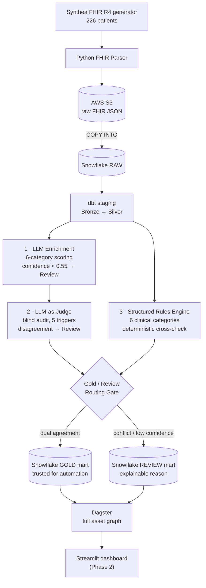

# Trust but Verify: Clinical AI Governance Engine

[](https://github.com/ericg1212/ai-healthcare-pipeline/actions/workflows/ci.yml)
[](https://github.com/ericg1212/ai-healthcare-pipeline/actions/workflows/codeql.yml)
[](https://codecov.io/gh/ericg1212/ai-healthcare-pipeline)
[](https://github.com/ericg1212/ai-healthcare-pipeline/releases)
[](https://www.python.org/)
[](https://www.snowflake.com/)
[](https://www.getdbt.com/)
[](https://dagster.io/)
[](https://aws.amazon.com/s3/)
[](https://hl7.org/fhir/R4/)


**By [Eric Grynspan](https://www.linkedin.com/in/ericgrynspan/)** &nbsp;·&nbsp; [← Denied](https://github.com/ericg1212/healthcare-claims-pipeline) &nbsp;·&nbsp; [Cleared →](https://github.com/ericg1212/agentic-rcm-pipeline)

---

Denied classified denials retrospectively. Trust but Verify adds AI governance. Cleared prevents the denial before it happens.

| Pipeline | Focus | Status |
|---|---|---|
| [Denied](https://github.com/ericg1212/healthcare-claims-pipeline) | Retrospective denial classification — separate 27K systematic denials with an upstream fix from 229K documentation failures requiring a different intervention | Live |
| **[Trust but Verify *(this project)*](https://github.com/ericg1212/ai-healthcare-pipeline)** | Clinical AI governance — LLM enrichment + rules engine cross-validation, every routing decision explainable | Live |
| [Cleared](https://github.com/ericg1212/agentic-rcm-pipeline) | Real-time prior auth prevention — in-memory payer criteria matching at point of submission, streaming ingestion | Live |

---

Clinical documentation gaps are the leading driver of prior authorization denials and downstream revenue loss — a problem that CMS-0057-F now mandates health systems address with real-time decision transparency. Yet most AI enrichment pipelines produce a risk score with no audit trail. This pipeline builds the governance layer that's missing: every LLM output is cross-validated by a deterministic rules engine, confidence scores flag uncertainty before it reaches production, and any conflict routes to a human review queue with an explainable reason. The result is a two-tier output — a **Gold layer** you can trust for automated action and a **Review layer** with a traceable reason for every flagged record.

**Trust but verify:** The LLM and the rules engine must agree for a record to pass to Gold. Conflict or low confidence → Review, automatically, with a reason.

---

## Why Dual Validation?

A single confidence score only tells you how certain the model is about its own output — it cannot catch domain rule violations a generalist model might miss. Two orthogonal validators, two different failure modes:

| Validator | Failure Mode It Catches |
|---|---|
| **LLM-as-Judge** | Statistical inconsistencies within the AI output — inflated scores, flat scoring, internal contradictions |
| **Rules Engine** | Domain violations — Medication Safety flags, care gaps, missing diagnoses in high-risk comorbidity clusters |

Both must agree for Gold. One disagrees → Review, with a reason.

---

## AI Layer

Four components run on every record. Components 1, 2, and 3 are live; 4 is Phase 2.

**1. LLM Enrichment** ✓ Live

Each condition and medication record is scored across 6 clinical quality dimensions. The LLM is called via `tool_use` — structured output only, no free-text parsing. The system prompt (~2,000 tokens) is prompt-cached, so calls 2–N in a batch cost ~10% of the first call's input token price.

| Category | What It Measures |
|---|---|
| `diagnosis_specificity` | SNOMED CT / RxNorm concept specificity — leaf-level concepts score high, broad category codes score low |
| `clinical_urgency` | Implied acuity — acute/life-threatening vs. stable chronic vs. preventive |
| `coding_accuracy` | Description-to-code alignment — catches mismatches between free text and coded values |
| `medication_appropriateness` | Whether the medication is clinically reasonable given the record context |
| `drug_condition_alignment` | Recognized drug-condition pairing — metformin + T2D, lisinopril + hypertension, etc. |
| `comorbidity_risk` | Multi-condition risk signal — T2D + CKD, metabolic syndrome clusters |

Each category returns a score (0.0–1.0) and a one-sentence rationale citing the specific code or clinical pattern. `overall_confidence` is a weighted average: `diagnosis_specificity` and `coding_accuracy` at 1.5×, all others at 1×. A Pydantic `model_validator` enforces that `overall_confidence` cannot diverge more than 0.25 from the category average — invalid enrichments raise at parse time, not silently downstream.

**2. LLM-as-Judge** ✓ Live

A second LLM call audits the enrichment result. The judge receives scores only — rationale is hidden to prevent anchoring bias. Five disagreement triggers are defined:

1. **Inflated score** — category ≥ 0.85 on a Synthea record with a broad-category SNOMED concept or generic description
2. **Deflated score** — category ≤ 0.25 on a well-known chronic condition or textbook first-line medication
3. **Internal inconsistency** — `coding_accuracy ≥ 0.8` with `diagnosis_specificity ≤ 0.4`, or `medication_appropriateness ≥ 0.85` with `drug_condition_alignment ≤ 0.3`
4. **Overall drift** — `overall_confidence` diverges more than 0.20 from the simple category average
5. **Flat scoring** — all 6 scores within 0.05 of each other (enricher was not discriminating)

When the judge disagrees, it returns `corrected_confidence`, the specific `disagreement_categories`, and a one-sentence clinical reason. Both LLM calls use prompt caching on their respective system prompts.

**3. Structured Rules Engine** ✓ Live

Deterministic Python — 6 categories (Diabetes & Metabolic, Cardiovascular, Medication Safety, Care Gaps, Data Completeness, Mental Health & Behavioral). Runs parallel to the LLM on every record. Flag aggregation rule: HIGH if `flags_fired ≥ 2` OR any Medication Safety flag fires.

**4. Gold / Review Routing** ✓ Live

LLM-as-Judge disagreement or rules engine conflict → Review queue with explainable reason. Full agreement → Gold layer. Three Gold record states: `enriched_clean` (trusted for downstream analytics), `enriched_review_conflict` (judge disagrees or rules fired), `enriched_review_low_confidence` (both agree but confidence < 0.55). Each Review record carries a `review_reason` string — a human-readable explanation of exactly why it was flagged.

---

## Design Decisions

| Decision | Why |
|---|---|
| **`tool_use` over free-text parsing** | Structured output enforced at the API level — malformed JSON is impossible, Pydantic validates at parse time |
| **Prompt caching** | Identical ~2,000-token system prompt across every record — calls 2–N cost ~10% of call 1 |
| **`model_validator` on `overall_confidence`** | HIGH overall confidence can't mask LOW category scores — ≤0.25 divergence enforced at parse time |
| **Rationale hidden from the Judge** | Anchoring bias — a judge that sees the reasoning rationalizes instead of auditing |
| **Deterministic rules alongside the LLM** | Medication Safety and comorbidity flags need a stable, auditable floor — LLMs drift run-to-run |
| **Confidence threshold below batch average** | 0.55 sits under the observed 0.584 — borderline records route to Review, not Gold |
| **Terminology validation before enrichment** | Drifted SNOMED/RxNorm codes produce confident but wrong enrichments — caught at the ingestion boundary |
| **Claude over GPT-4 / Gemini** | `tool_use` is a first-class primitive, caching is native, and the context window fits full patient injection |

---

## Results

| Metric | Value |
|---|---|
| Records enriched | 174 (166 judged — 8 judge API errors) |
| Avg overall_confidence | 0.584 across conditions + medications |
| **Gold clean** | **13 (7.8%) — passed dual validation + confidence ≥ 0.55** |
| Review — low confidence | 39 (23.5%) — judge agreed, no flags, confidence < 0.55 |
| Review — conflict | 114 (68.7%) — judge disagreement or rules engine flag |
| Confidence threshold | 0.55 — set conservatively below batch avg (0.584) |
| Most common Judge trigger | Internal inconsistency (`coding_accuracy` vs. `diagnosis_specificity`) |
| Social SNOMED edge case | 52 social/contextual codes (employment, housing) legitimately score high `coding_accuracy` + low `diagnosis_specificity` — a judge Trigger #3 calibration gap, scoped for follow-up |
| Prompt cache hit rate | ~90%+ on batches > 10 records |
| Pydantic validation failures | Raised at parse time — zero silent failures downstream |

> **On the 7.8% Gold rate:** The dual-validator design routes uncertainty to Review by design. Synthea's broad-category SNOMED concepts reliably trigger the Judge's internal-consistency check; real EHR data with leaf-level codes and clinical documentation yields a materially higher Gold rate. The metric that matters is traceability — every non-Gold record carries an explainable reason, making the Review queue actionable rather than a black box.

---

## Stack

| Layer | Technology |
|---|---|
| Synthetic data | Python FHIR R4 (Synthea) |
| Raw storage | AWS S3 |
| Warehouse | Snowflake |
| Transformation | dbt |
| AI enrichment | LLM API (Anthropic) |
| Orchestration | Dagster |
| Dashboard | Streamlit *(Phase 2)* |
| CI | GitHub Actions |

---

## Architecture




*8-asset Dagster pipeline — ingestion → staging → AI enrichment (parallel) → LLM-as-Judge → Gold/Review routing → dbt marts*

---

## Project Structure

```
ai-healthcare-pipeline/
├── data_ingestion/      # Synthea wrapper · FHIR R4 parser · S3 upload + Snowflake COPY INTO
├── ai_layer/            # enricher, judge, rules engine, router · Pydantic schemas · CLI
├── dbt_pipeline/        # staging views + gold_records / review_records marts
├── dagster_pipelines/   # 8 software-defined assets: ingestion → enrichment → routing → marts
├── streamlit_app/       # dashboard (Phase 2)
└── tests/               # pytest unit tests
```

---

## Setup

```bash
git clone https://github.com/ericg1212/ai-healthcare-pipeline.git
cd ai-healthcare-pipeline
cp .env.example .env          # populate with your credentials
pip install -r requirements.txt
make test
```

See `.env.example` for required environment variables.

---

## Note on Synthetic Data

All patient records are generated by the Synthea synthetic patient engine. No real PHI is used, stored, or transmitted at any point in this pipeline.
